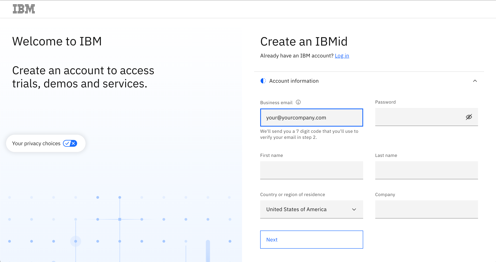

# Crea tu IBMid

**Nota:** Sigue estas breves instrucciones para crear un IBMid. Estas están específicamente dirigidas a nuestros Business Partners y clientes que pueden no tener acceso a un entorno TechZone previamente. Los empleados de IBM no necesitan registrarse.

Los clientes y Business Partners DEBEN tener un IBMid ANTES de ser invitados a los entornos del workshop. Los participantes NO recibirán el correo electrónico invitándolos a la cuenta del workshop a menos que ya tengan un IBMid.

1. Comienza accediendo a la [Página de Registro de IBMid](https://www.ibm.com/account/reg/signup?formid=urx-19776&).
2. Ingresa la información requerida en los campos proporcionados, como dirección de correo electrónico, nombre, empresa y país.

```IMPORTANTE: ¡Tu dirección de correo electrónico se convierte en tu IBMid, el cual utilizarás para acceder al entorno del workshop!```




4. Haz clic en el botón Next. Recibirás un correo electrónico que contiene un código de verificación de un solo uso.
5. En el campo Verification, ingresa el código que se proporciona en el correo electrónico.
6. Haz clic en Create account.
7. Se enviará un correo electrónico indicando que la creación de tu cuenta IBMid fue exitosa y tu cuenta ahora está activada.
8. No es necesario ingresar ninguna información de tarjeta de crédito. Este mensaje desaparecerá una vez que hayas sido invitado al entorno del workshop.
