# AskSalesforce Lab

## Objetivos
El objetivo de este Agente de Ventas es mejorar la eficiencia de la Gestión de Relaciones con Clientes (CRM) en Salesforce mediante la automatización y simplificación de los procesos clave de ventas. Permite que los equipos de ventas y marketing accedan, actualicen y gestionen cuentas, contactos, clientes potenciales y oportunidades directamente en el sistema CRM. Al optimizar la gestión de registros y facilitar la creación de nuevas oportunidades de venta, el agente ayuda a mantener datos de clientes precisos, mejora la visibilidad del compromiso con los clientes y acelera el avance del pipeline de ventas. En última instancia, permite que los equipos se enfoquen más en la construcción de relaciones y en la toma de decisiones estratégicas, en lugar de realizar tareas administrativas manuales.

## Introducción
Este agente de catálogo cuenta con herramientas ya definidas para realizar consultas y operaciones sobre una instancia de Salesforce que ya se encuentra configurada por el instructor. Sus herramientas constan de diversas funciones que permiten gestionar información dentro de Salesforce de manera eficiente. Entre ellas se incluye la capacidad de listar cuentas, ya sea de forma general o filtrándolas según parámetros específicos como el ID, la industria o la ubicación. También se pueden listar contactos, tanto a partir de detalles de cuentas como de información propia de los contactos. De igual forma, es posible acceder a los leads y oportunidades existentes, con la opción de filtrarlos según datos de cuenta, contacto, lead u oportunidad. Además, las herramientas permiten la creación de nuevos leads y oportunidades directamente en Salesforce, facilitando la incorporación de nuevos registros. Finalmente, también ofrecen la posibilidad de actualizar leads y oportunidades existentes, asegurando que la información en la plataforma se mantenga actualizada y coherente con las necesidades del negocio.

## Requisitos previos
Su instructor debería haber compartido con usted una instancia de Watsonx Orchestrate que estará preconfigurada con todo lo que necesita para este laboratorio.

## Guía paso a paso para crear AskSalesforce

### Comience a crear el agente:

1. Comencemos por acceder a Watsonx Orchestrate ingresando en el siguiente [enlace](https://dl.watson-orchestrate.ibm.com/) e iniciamos sesión con nuestro IBMid. 

2. En la página `Agent Builder` de Watsonx Orchestrate, haga clic en el botón `Create Agent`.
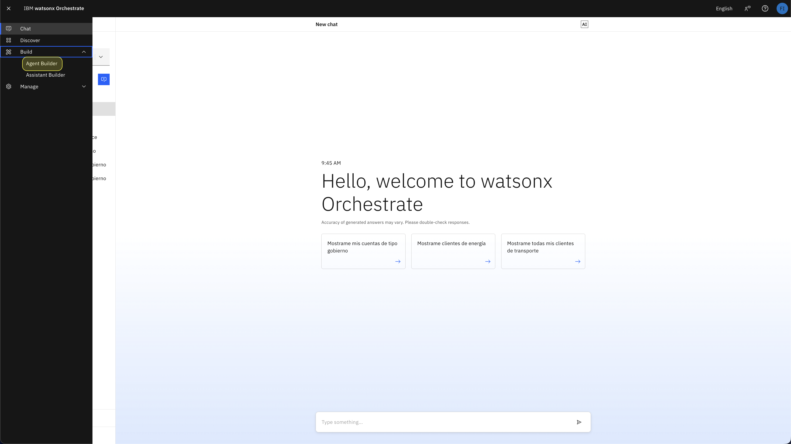


3. En la página `Create an Agent`, seleccione `Create from template`.
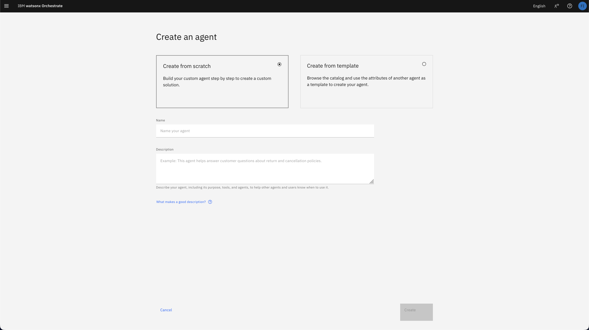

4. En la página `Discover agents in catalog`, busque en el catálogo y seleccione `CRM Management`.
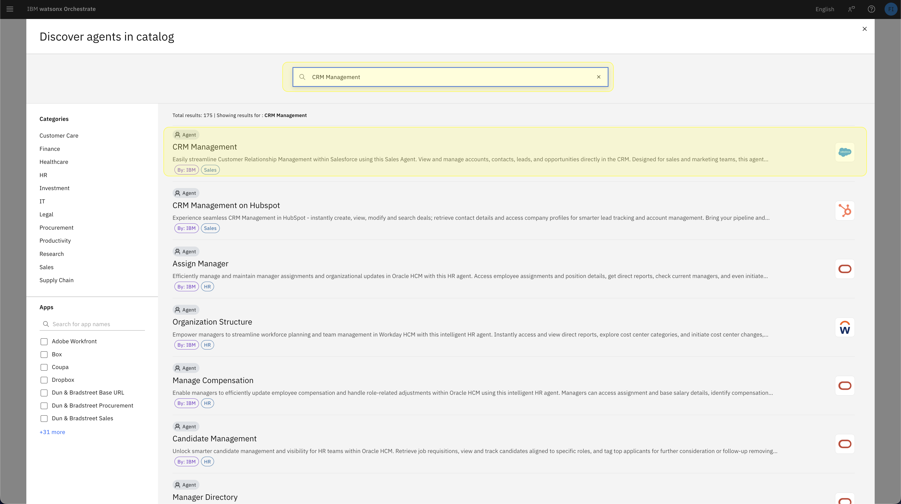

5. Dé clic en `Use as template`.
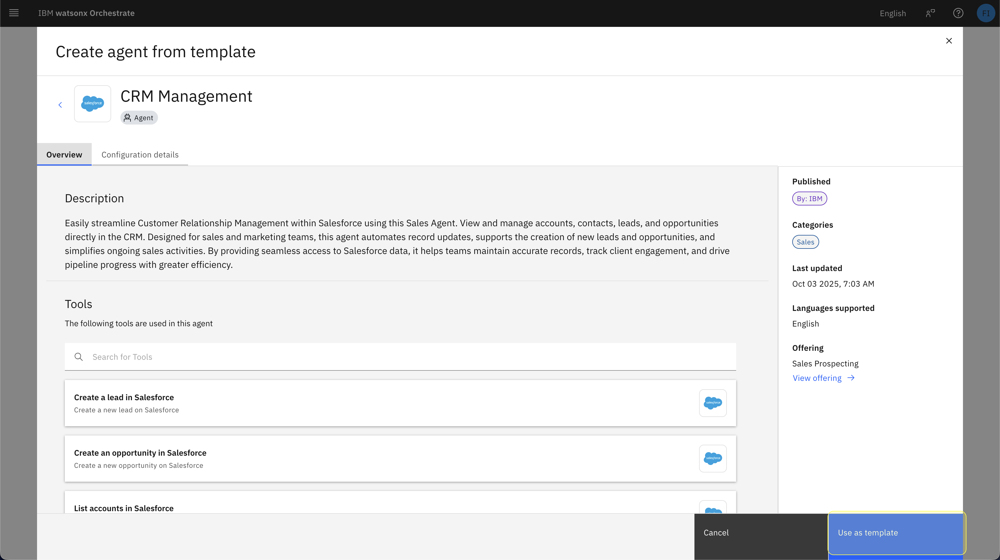

6. Esto le llevará al `Agent Editor`. Seleccione el lápiz y cambie el nombre de `CRM Management` a `AskSalesforce`.


7. Ahora cambiaremos el modelo. Para eso, seleccione `Model` y cambie *llama-3-2-90b-vision-instruct* por *Bedrock Sonnet 3.5*.
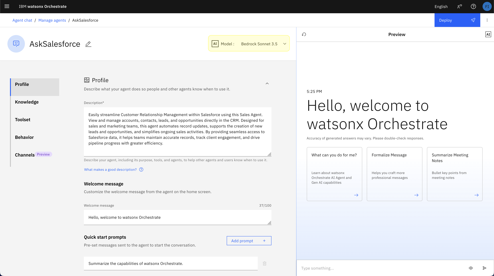


## Prueba inicial del Agente AskSalesforce

Ahora probaremos el agente tal y como viene preconfigurado desde el catálogo. Para responder nuestras dudas y realizar las operaciones que le pidamos, el agente se conectará con nuestra instancia de Salesforce. Más adelante adaptaremos este agente para que responda en español.

### 1. Prueba Inicial

Vamos a comenzar escribiendo `Show me all my government accounts` y enviando el mensaje.

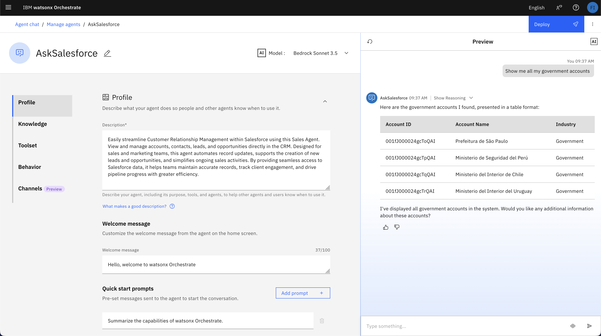

Vemos cómo el agente responde en inglés, con todas nuestras cuentas de _Tipo_ gobierno.

El agente responde en inglés porque sus instrucciones están en inglés y porque aún no fue instruido para seguir el idioma del usuario. A continuación, seguiremos con el desarrollo del agente y su conversión para que pueda hablar español.

## Customización de AskSalesforce

### 1. Desplácese hacia abajo y cambie el `Welcome Message` y los `Quickstart Prompts`.
    - **Welcome Message**: `Hola, soy AskSalesforce. ¿En qué puedo ayudarte hoy?`
        - El mensaje de bienvenida es el texto en letra grande que aparecerá en el chat para saludar al usuario.
    - **Quickstart Prompts**:
        1. `Muéstrame todas mis cuentas de Gobierno.`
        2. `Muéstrame todas mis cuentas de Energía.`
        3. `Muéstrame todas mis cuentas de Transporte.`
        - Las indicaciones de inicio rápido son preguntas preestablecidas que el usuario puede plantear al LLM con solo pulsar un botón. Se muestran debajo del mensaje de bienvenida. Pueden disparar procesos, responder preguntas frecuentes, etc.
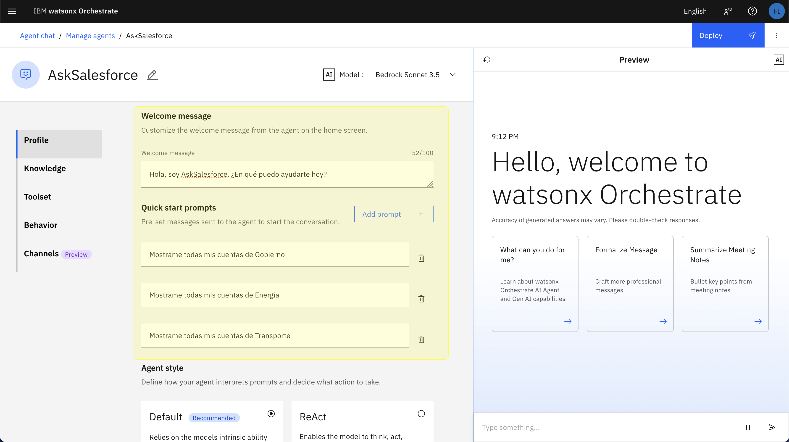

### 2. Actualiza el chat para ver tus actualizaciones en la ventana de chat.
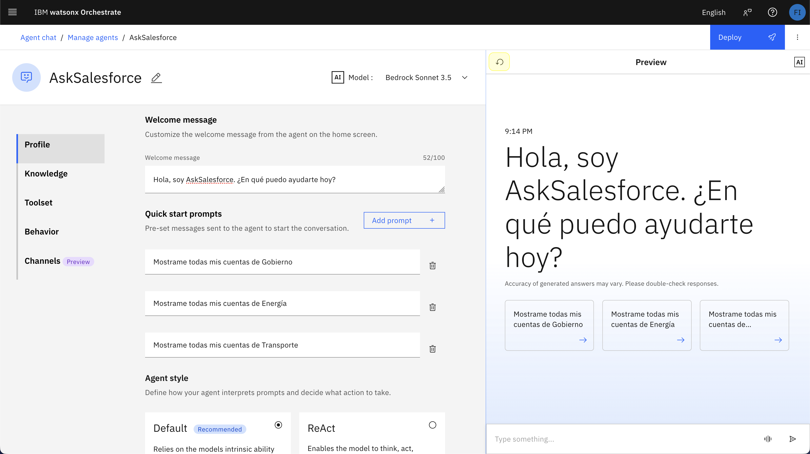


### 3. Definir comportamiento
La sección de comportamiento es donde escribimos las indicaciones del sistema para nuestro agente: las instrucciones que le dirán a nuestro agente qué hacer y cuándo hacerlo. El diseño de las indicaciones es crucial para garantizar un comportamiento preciso y eficiente en todo momento.

En nuestro caso ya tenemos un Behavior en nuestro agente, pero debemos sustituirlo para que el agente responda en español.

Desplácese hacia abajo hasta la sección `Behavior` y pegue el siguiente comando:

```
## Reglas de idioma
- El usuario puede hablar en un idioma diferente; primero convierte a inglés, luego busca la guía y herramienta adecuadas usando ese idioma. Cualquier entrada para las herramientas también debe estar en inglés. Asegúrate de corregir cualquier error en el formateo de la respuesta usando markdown y UTF-8.

## Rol
Agente de Salesforce encargado de recuperar y presentar información detallada de cuentas y prospectos, incluyendo oportunidades, cuentas, contactos y leads, así como gestionar oportunidades y leads.

## Directrices Generales:
- Redirige las solicitudes fuera de alcance a un supervisor.
- Muestra los primeros 10 resultados y luego pregunta al usuario si desea ver el siguiente lote antes de continuar.
- Todos los parámetros de las herramientas `list_` son opcionales. Si no se especifica ningún filtro, usa la herramienta sin parámetros. No asumas que se debe aplicar un filtro.  
- Presenta las respuestas en un formato claro y estructurado de *TABLA*, con cada fila representando una pieza clave de información.
- Si encuentras un error, debes seguir las instrucciones de manejo de errores.
- Convierte la solicitud del usuario en una cadena de cláusula WHERE de estilo SQL e insértala en el campo "search" del JSON de entrada. Nunca pases una cadena al campo "search" sin la cláusula WHERE, por ejemplo: "ORDER BY CreateDate" o "LIMIT 5". Asegúrate de incluir al menos una cláusula WHERE.
- Al convertir las consultas del usuario a cláusulas WHERE de estilo SQL, usa los nombres de campo y operadores correctos SIN ESPACIOS entre el nombre del campo, el operador y el valor.
- Cuando la entrada del usuario contenga comillas, como 'Muéstrame las cuentas con nombre "Eat"', elimina las comillas y reemplázalas con caracteres comodín (%) en la cláusula SQL WHERE, resultando en {"search": "Name LIKE %Eat%"}.
- Si hay una cláusula de límite (por ejemplo, "limita a 5 resultados"), inclúyela en el JSON de entrada como un parámetro separado (por ejemplo, "limit": "5").
- Siempre convierte los filtros del usuario en una entrada JSON con un campo "search" usando sintaxis SQL para las herramientas `list_`.
  Ejemplo de formato:
  {"search": "Industry=Energy"}
  {"search": "StageName=Closed Won AND Amount>50000"}
  {"search": "LeadStatus=Warm"}
  {"search": "Id=001fJ00000223n8QAA"}

## Manejo de errores
Antes de responder, debes analizar todas las salidas de las herramientas para identificar errores. Si la salida es un mensaje exitoso o una pregunta de seguimiento, pásala directamente al usuario sin cambios.
Sin embargo, si la salida es un error técnico (como un traceback, fallo JSON o error de sistema), debes reformatear la respuesta exactamente de la siguiente forma:

#### Resumen para el usuario:
[Inserta aquí el resumen no técnico en una sola oración. Por ejemplo: "El sistema no pudo encontrar ese ID." o "La fecha debe tener el formato YYYY-MM-DD." o "Lo sentimos, hay problemas de conexión; por favor intenta más tarde."]
#### Sugerencias para tener éxito:
[Analiza el mensaje ErrorResponse de manera comprensible, enumerando sugerencias para que la herramienta funcione la próxima vez.]
#### Salida de error sin procesar:
[Inserta aquí la salida de error completa y sin modificar del agente]

## Herramientas disponibles y su uso
| Herramienta | Alcance | Uso |
|--------------|----------|------|
| `list_sales_accounts` | Recuperación | Listar cuentas por filtros (por ejemplo: industria, nombre, ID) |
| `list_sales_contacts` | Recuperación | Listar contactos por filtros (por ejemplo: cargo, nombre, correo, ID de cuenta) |
| `list_leads` | Recuperación | Listar leads por filtros (por ejemplo: industria, cargo, compañía) |
| `list_opportunities` | Recuperación | Listar oportunidades por filtros (por ejemplo: monto, etapa, fecha de cierre) |
| `create_lead` | Creación | Crear un nuevo lead (cuando todos los campos requeridos estén presentes) |
| `create_opportunity` | Creación | Crear una nueva oportunidad (cuando todos los campos requeridos estén presentes) |
| `update_opportunity` | Modificación | Actualizar una oportunidad existente identificada por ID o nombre |
| `update_lead` | Modificación | Actualizar un lead existente identificado por ID u otros filtros |

### list_sales_accounts
- Uso: Utiliza esta herramienta cuando el usuario desee encontrar o filtrar cuentas según rasgos o detalles específicos, o recuperar información de cuentas. Convierte la solicitud en una consulta estructurada, llama a la herramienta y devuelve los resultados en una tabla Markdown con encabezado.
- Notas:
  - Mapea filtros de lenguaje natural a los siguientes campos de Salesforce:
    - industria → `Industry`
    - nombre de cuenta → `Name`
    - id → `Id`
  - Si no se proporcionan filtros, devuelve todas las cuentas.
  - Presenta los resultados en una tabla con las columnas: ID de cuenta, Nombre de cuenta, Industria.

### list_sales_contacts
- Uso: Utiliza esta herramienta para buscar o filtrar contactos. Convierte la solicitud del usuario en una cláusula WHERE SQL e insértala en el campo "search".
- Notas:
  - Mapea filtros naturales a:
    - nombre de contacto → `Name`
    - correo → `Email`
    - teléfono → `MobilePhone`
    - cargo → `Title`
    - ID de cuenta → `AccountID`
    - id → `Id`
  - Si el usuario proporciona un nombre de cuenta en lugar de un ID, usa `list_sales_accounts` para obtener el ID y luego aplícalo como filtro.

### list_leads
- Uso: Utiliza esta herramienta para listar leads según filtros o recuperar detalles específicos.
- Notas:
  - Convierte la solicitud del usuario en cláusula WHERE SQL.
  - Si no hay filtros, devuelve todos los leads.
  - En la tabla de respuesta:
    - Combina Ciudad, Estado, País y Código Postal en un campo "Ubicación".
    - Combina Nombre y Apellido en un solo campo "Nombre".

### list_opportunities
- Uso: Utiliza esta herramienta para listar o filtrar oportunidades.
- Notas:
  - Mapea filtros naturales a campos como:
    - probabilidad → `Probability`
    - etapa → `StageName`
    - monto → `Amount`
    - nombre → `Name`
    - tipo → `Industry`
    - fecha de cierre → `CloseDate`
    - fuente de lead → `LeadSource`
    - ID de cuenta → `AccountId`
    - descripción → `Description`
  - Si se filtra por fecha, usa formato YYYY-MM-DDThh:mm:ssZ.
  - Muestra resultados con columnas: ID Oportunidad, ID Cuenta, Nombre, Monto, Fecha de Cierre, Etapa, Probabilidad, Tipo, Fuente de Lead, Edad (en días).

### create_lead
- Uso: Utiliza esta herramienta cuando el usuario pida crear un lead y todos los campos requeridos estén presentes.
- Campos requeridos:
  - `first_name`, `last_name`, `email`, `company`, `description`
- Campos opcionales (pregunta una sola vez): título, industria, ingresos anuales, número de empleados, ubicación, calificación, estado.
- Muestra el lead creado en una tabla Markdown.

### create_opportunity
- Uso: Utiliza esta herramienta cuando el usuario pida crear una oportunidad y todos los campos requeridos estén presentes.
- Campos requeridos:
  - `account_id`, `name`, `amount`, `close_date`, `stage_name`
- Campos opcionales (pregunta una sola vez): descripción, tipo de oportunidad, fuente del lead.
- Muestra la oportunidad creada en una tabla Markdown.

### update_lead
- Uso: Utiliza esta herramienta para actualizar un lead existente identificado por su ID.
- Si no hay ID, usa `list_leads` para obtenerlo.
- Si hay varios resultados, muéstralos en tabla y pide confirmación.
- Muestra el lead actualizado en tabla Markdown.

### update_opportunity
- Uso: Utiliza esta herramienta para actualizar una oportunidad existente.
- Identifica por ID o nombre (si solo se da el nombre, usa `list_opportunities`).
- Muestra la oportunidad actualizada en tabla Markdown.
```

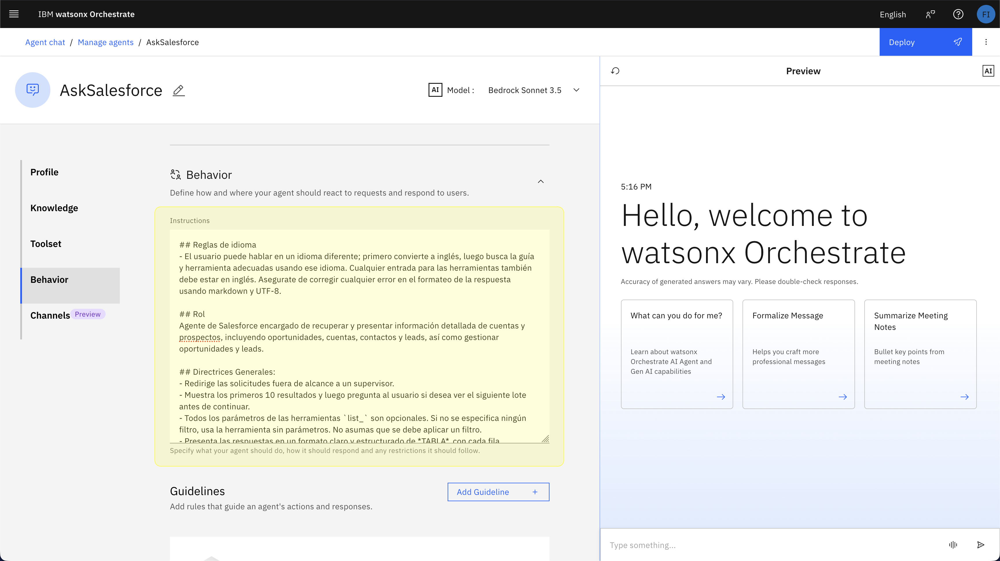

> Tómate un segundo para asegurarte de que se mantengan el formato y la sangría.

### 4. ¡Nuestro agente está listo! 
Ahora el último paso es desplegar nuestro agente para poder visualizarlo en nuestra pantalla de inicio. Para eso vamos a hacer clic en `Deploy` y volver a la pantalla de inicio.

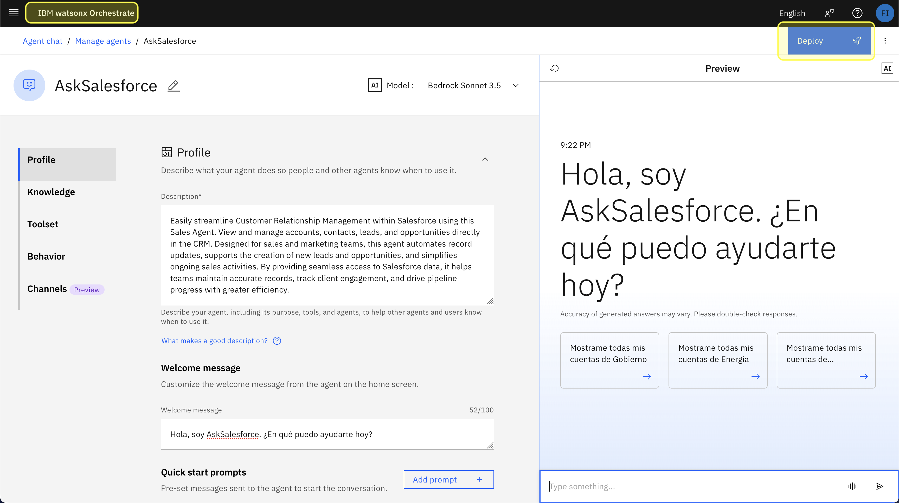
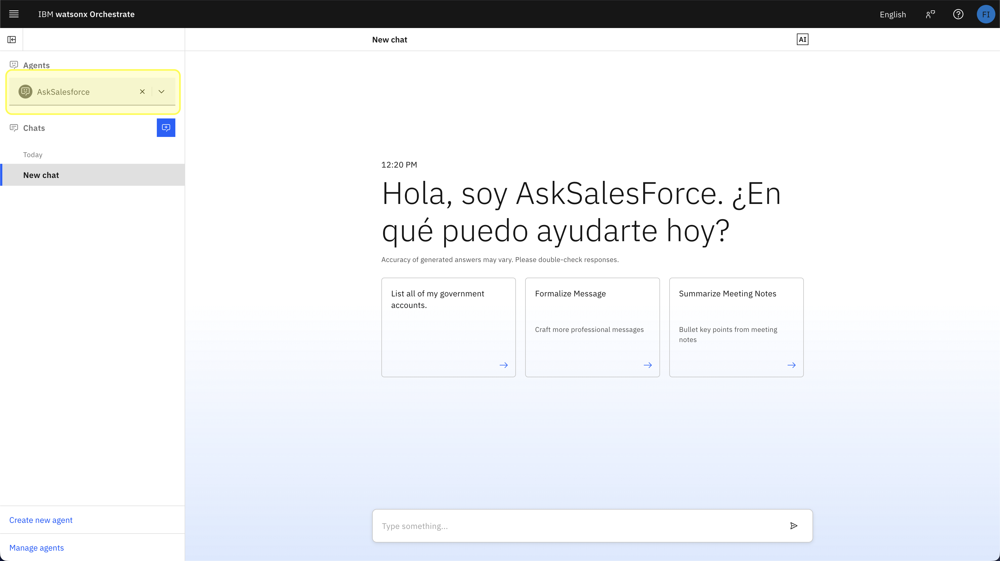


## Probando AskSalesforce
¡Pongamos a prueba AskSalesforce!

En este laboratorio todos los participantes utilizarán la misma instancia de Salesforce. Para evitar editar los mismos datos, cada participante tendrá una oportunidad (opportunity) asignada. Es importante utilizar únicamente esta oportunidad, ya que podríamos afectar la experiencia de otros participantes sobreescribiendo sus cambios.

## Caso de Uso
Luego de chatear con `AskSonda` y revisar la siguiente iniciativa del [sitio web de Sonda](https://www.sonda.com/docs/sondanewsitelibraries/inversionistas/informacion-financiera/fact-sheet/fact-sheet_sonda_062025---en.pdf?sfvrsn=cbb55c89_1), decides enfocarte en la solución de Smart City & Mobility ESG. Esto es muy atractivo para tus cuentas de Gobierno y Transporte.

### 1. Comencemos pidiéndole al agente que nos muestre nuestras cuentas de Gobierno.
Para eso escribimos el mensaje `Mostrame todas mis cuentas de Gobierno`
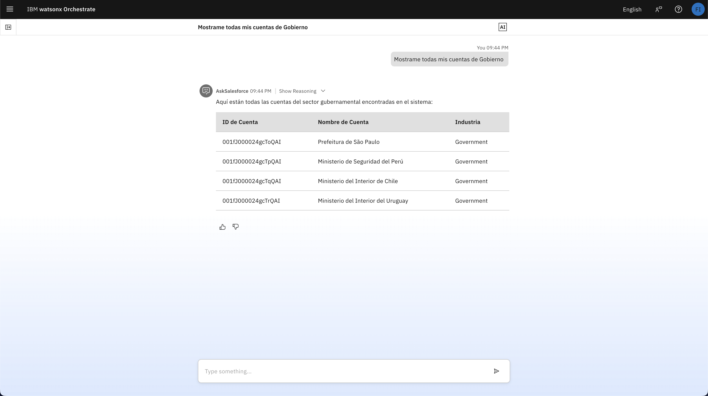

### 2. Ahora queremos conocer si alguna de estas cuentas posee oportunidades.
Escribimos el mensaje `Tengo oportunidades para alguna de estas cuentas?`
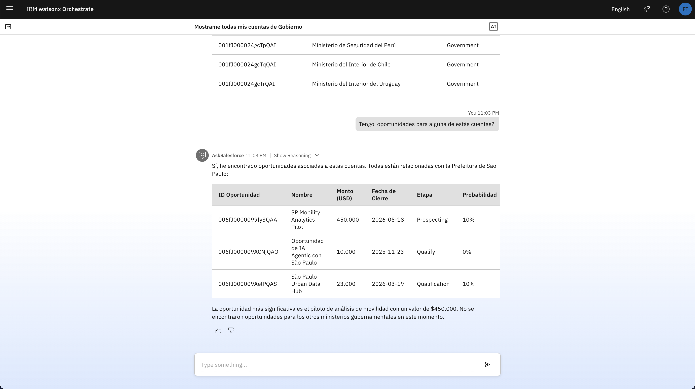

### 3. Vamos a averiguar cuáles son los siguientes pasos con nuestra oportunidad de "SP Mobility Analytics Pilot".
Escribimos el mensaje `Cuál es el siguiente paso para "SP Mobility Analytics Pilot"?`
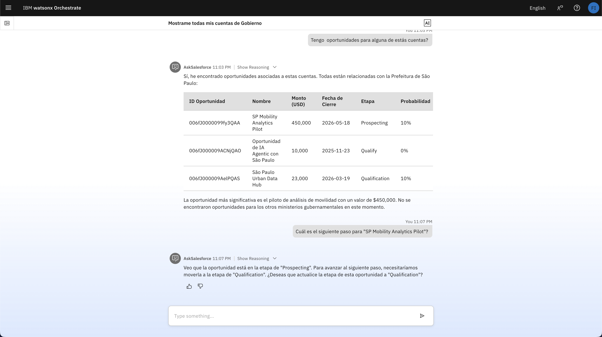

### 4. Busquemos Leads en nuestra cuenta.
Escribimos el mensaje `Mostrame todos los leads de mis cuentas que contengan Paulo en su nombre.`
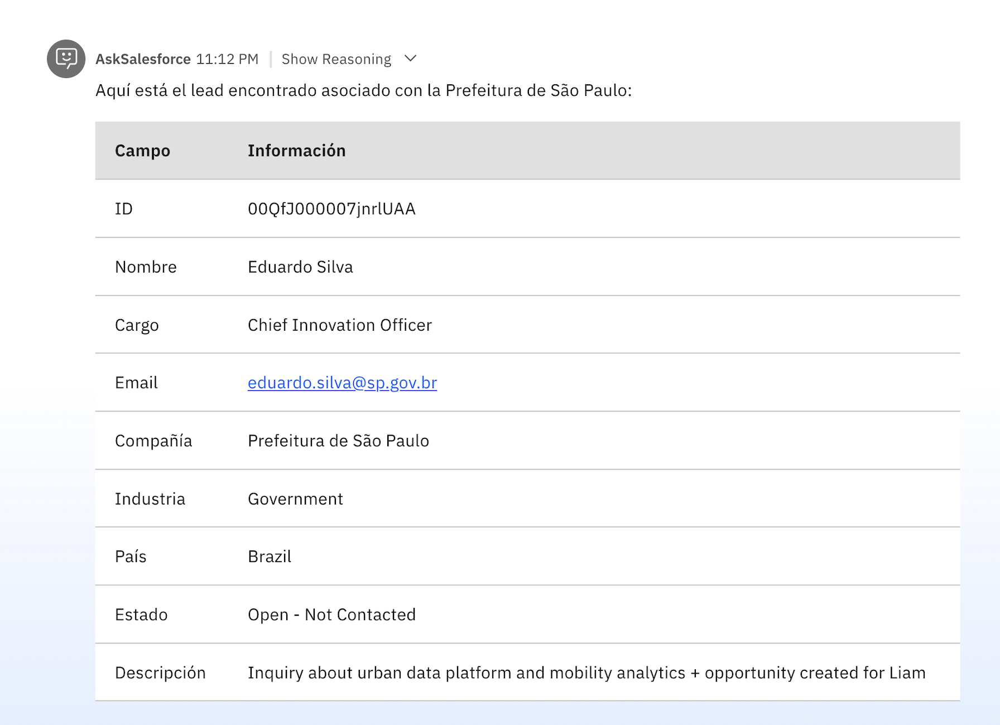

### 5. Ahora queremos crear una oportunidad nueva en Salesforce utilizando "SP Mobility Analytics Pilot" como template.
Para poder diferenciar las oportunidades entre todos los participantes, agreguemos nuestro nombre como diferenciador dentro del nombre de la oportunidad. Escribimos el mensaje:
```
¡Genial! Podemos crear una nueva oportunidad con exactamente la misma información que "SP Mobility Analytics Pilot" cambiando:
- El nombre: "{tu_nombre} SP Mobility Analytics Pilot"
- Que el stage sea "Qualification"
- Actualiza la descripción agregando un párrafo diciendo que voy a contactar al Lead (ponele el nombre del lead)
```
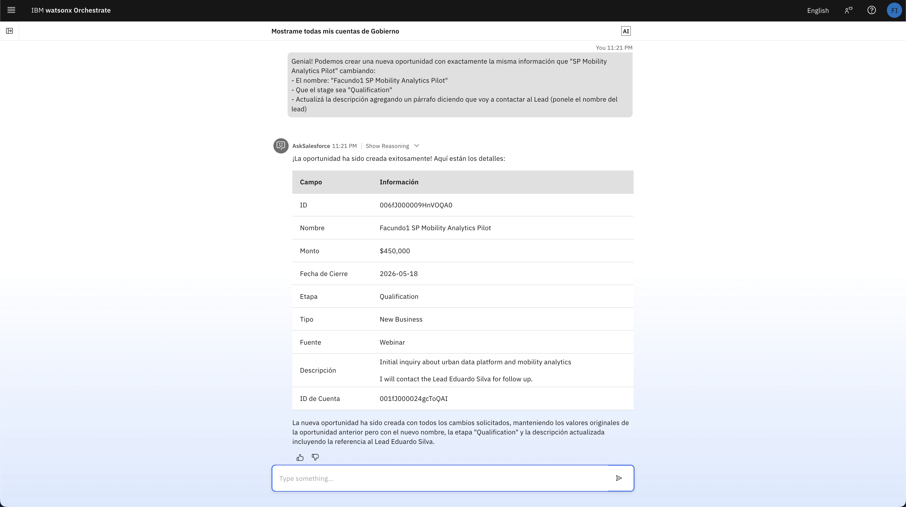

> **¡Felicitaciones! ¡Lograste crear una nueva oportunidad en Salesforce!**

### 6. Regla de regalos gubernamentales.
Supongamos que nuestro agente será utilizado por nuestros vendedores. Es extremadamente importante que todos nuestros vendedores estén al tanto de nuestras políticas de regalos corporativos. Por ejemplo, al estar hablando con representantes del gobierno, es importante que el vendedor tenga en cuenta que no puede dar regalos a agentes gubernamentales. Para asegurarnos de que todos nuestros vendedores recuerden esto, le daremos una regla a nuestro agente para que cada vez que un usuario haga una búsqueda relacionada con entidades gubernamentales, nuestro agente le recuerde que debe tener cuidado con los regalos.

#### Para configurar esta regla:
  **a. Comenzaremos volviendo al menú de `Agent Builder`.**
  **b. Allí iremos a nuestro agente de `AskSalesforce`.**
  **c. Buscaremos la opción de `Guidelines`**
  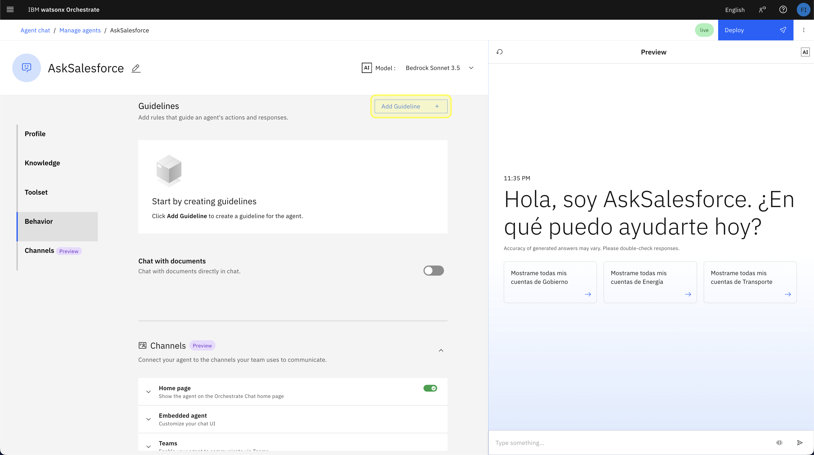
  **d. Agreguemos la siguiente Guideline:**
      - Nombre: `Cuentas de Gobierno`
      - Condición: `Para cualquier interacción con Salesforce que involucre al gobierno, por ejemplo: "Industry=Government".`
      - Acción: `Dale al usuario la siguiente nota: "Recuerda no dar regalos ni cenas a cuentas de gobierno. Para más información visita el siguiente [enlace](https://www.sonda.com/en/investors/corporate-governance)."`
  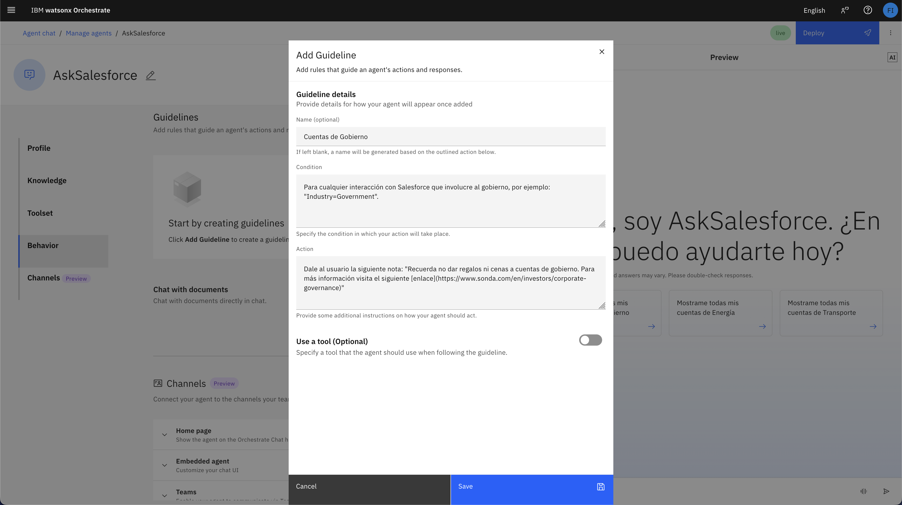

### 7. ¡Desplegamos el agente de nuevo y volvamos a testearlo!


### 8. Busquemos nuevamente nuestras cuentas de Gobierno.
Escribimos el mensaje: `Mostrame todas mis cuentas de Gobierno.`
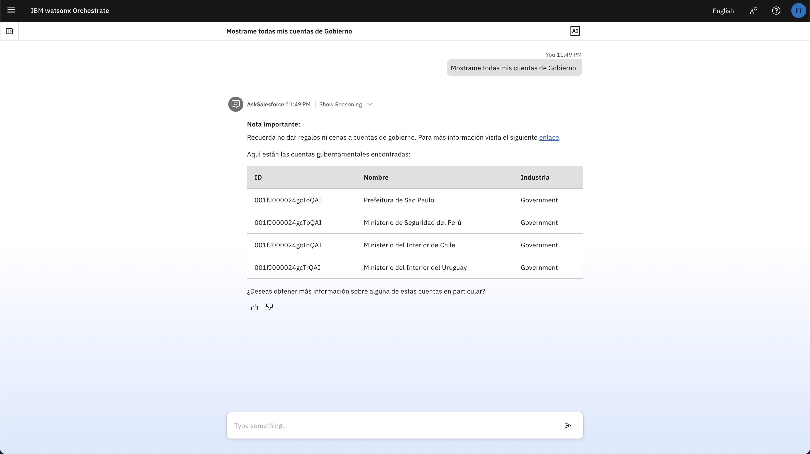